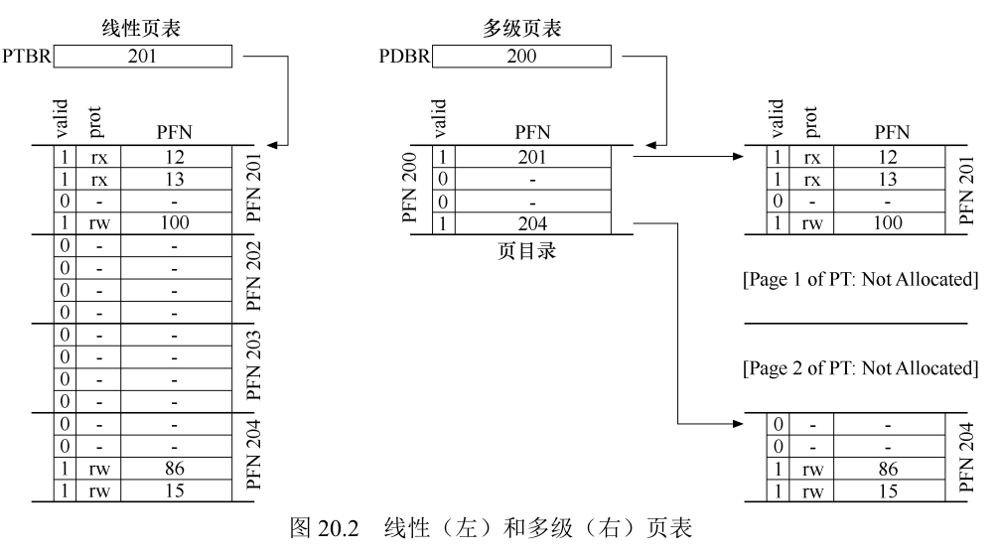

# 内存管理
## 前言  

早期直接使用物理地址访问内存进行编程，会面临以下几个重大问题:
- 动态分配和回收内存(程序运行时地址写死，既不利于分配也不利于回收)
- 内外部碎片问题
- 进程隔离和安全问题

为一个进程提供一对简单的基址/界限寄存器，实现虚拟地址到物理地址的简单映射，这样做有两个好处：  
- 进程的物理地址受到了基址寄存器的控制，不再写死;
- 界限寄存器提供了地址越界判断，保证了隔离和安全；

在这一层简单映射下，进程物理地址可通过基址寄存器重定位且受界限寄存器保护，然而还有以下显著问题:
- 堆区和栈区存在大块未使用的内存预留区域，产生内部碎片利用不充分
- 没有进程换入换出机制

## 分段
基于以上问题引入分段机制——将每个进程占用的虚拟空间划分为代码段/堆/栈几个逻辑分段，段寄存器内保存着每  
个逻辑分段提供一对逻辑基址/界限寄存器/反向位/保护标志位。尽管不存在内部碎片了，但还是有外部碎片。  
进程的物理地址可以通过显式规定段号来确定是哪个段，  段号 | 段内偏移
注意栈区的地址是反向增长，计算栈物理地址时注意取反
  
C语言的free(ptr)调用无需显式地指定释放内存块区域大小，是因为在malloc时候，实际分配的内存块前保存了  
一个header的内存块元数据,free只需在ptr地址前寻找到元数据就能获得释放的内存块大小，这个元数据不但保  
存着分配块内存的信息，还保存着空闲块内存的信息
堆内存的分配和回收都对应着空闲列表的分割和合并操作  
为空闲列表的分配空闲列表，底层是通过系统调用mmap()实现

# 分页
## 分页机制
只要分配内存大小不一，分段机制只能通过算法减少物理内存排布不紧凑的情况，但无法消除，引入更大的内存分配  
单元——内存分页机制。虚拟地址空间和物理地址空间的最小内存单元不再是字节而是页。对应的，以前的地址变成了
页号。虚拟地址也划分为页号和页内偏移，物理地址 = 页表映射\[页号\] + 页内偏移  
页表——记录着<虚拟页号, PTE>映射信息,保存在物理地址空间，页表寄存器保存着页表起始位置的物理地址。

PTE记录者页表项元信息，例如保护位/存在位/脏位/物理地址页号，决定着该页的读写执行模式以及当前页状态

## 分页管理技术-快速地址转换TLB
然而页表在被映射为物理地址的过程中有多次访存操作（先从内存查页表项，再查物理页号），因此空间和效率上都存在问题
为解决页表映射过程中的访存操作带来的效率问题，计算机的MMU硬件增加了一层缓存Cache(TLB)，每次访存  
前都会先查找访问TLB，同页元素的TLB命中。不同页元素会导致TLB不命中
TLB不命中后可以采取硬件处理，也可以引发中断让操作系统程序员处理  
TLB在进程切换时的策略问题：TLB项新增地址空间标识符ASID(类似于PID标识)  
TLB表项替换更新策略:LRC和随机采样  

页表本身保存着大量信息占据着大量内存空间，必须设法降低页表的内存占用开销。考虑采用以下思路：
## 段页结合
每个逻辑段，段基寄存器中保存着页表的物理地址，界限寄存器
## 多级页表
直接用页表存储<页号，PTE>映射信息会有如下问题:
- 大量无效页表项会被分配物理内存
- 内存的新增和回收限制较大

多级页表的概念与图形学的八叉树、BST的二叉存储理念非常类似，都是通过分级分而治之达到存储结构和查找效率的优化  
页表比喻为一本没有目录的书，一级页表就是这本书的目录，类比于为页表再创建一级页表映射  
虚拟页号再一次被拆分为:VPN = 目录索引 | 页表索引  
对页表这本书内的许多无效页(留白页)，后续不再为其分配物理空间  

设定多级目录好处是更高的有效页表利用率，对应的代价就是TLB未命中时的多级查找
## 交换空间
随着多道程序的增多需要越来越多的页表，有限的物理内存空间已不足以满足这种需求了，为了获取比物理  
内存更大的寻址空间，计算机在硬盘上开辟了一部分专门的交换空间，用于暂时腾出内存中部分进程的页表。  
访问不在物理内存上的页，称之为缺页和页错误。
操作系统后台会有页守护进程，当物理内存可用空间到达警戒线时自动进行换页操作
1. 页置换策略——最少最近使用LRU  
LRU策略在许多场景下例如纯随机作业，遵循局部性原理的作业，以及2-8特性的作业有较低的缺页率。  
然而它的本质决定了在顺序循环执行的作业中会一直发生缺页.  
完美的LRU机制实现代价太大，但有个近似的LRU机制——通过为页新增一个使用位，每次被调入物理内存  
时会使使用位置1，置零则由操作系统决定。CLOCK算法会遍历那些置零的页将他们换出并指针向下一页
由于一些页虽被置换然而并未被写入，置换掉这些未被改写的页代价很小(因为未被改动所以不需写入磁盘)，  
因此页新增一个脏位。
## 真实的虚拟地址空间——VAX/VMS虚拟内存系统
每个进程拥有32位地址空间且512字节的页(很小的分页，所以减少页表占用是首要问题)，每个地址空间  
分为了用户空间和系统空间，操作系统内核代码将被全部进程共享

